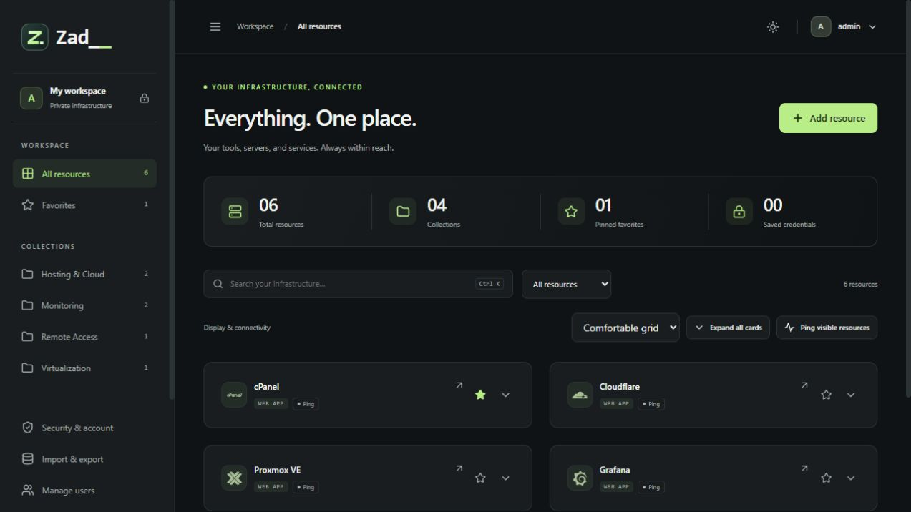

# Using ZadDesh

[Overview](../README.md) · [Self-hosting](SELF_HOSTING.md)

ZadDesh gives each user a private dashboard of infrastructure shortcuts and encrypted credentials. **Mahzaidex Tech · Developed by Hasnain Zaidi.**

## First sign-in

Visit your installation's address. A new installation creates `admin` with a temporary password printed in the server console, unless the operator supplied an initial password. Change this password immediately when prompted. New accounts must also change their temporary password before using the dashboard.

Choose a long, unique password and retain it securely. Optional TOTP and passkeys are available in account security settings. A passkey can authenticate you but does not replace the password needed to unlock the credential vault. Admins cannot reset another user's password to access their vault.

## Add your first resource

1. Choose **Add resource**.
2. Enter a recognizable name, such as Production Grafana.
3. Enter the web URL or remote address and choose the appropriate open method.
4. Select a category and a bundled icon. Search the icon picker, upload a supported PNG/SVG, or use the favicon option where supported.
5. Add optional notes and credentials, then save.

Use the full `https://` address for web panels. For remote connections, use the host/user/port fields and validation in the form rather than entering shell commands. AnyDesk and RustDesk entries use their destination IDs. Do not put passwords in URLs or descriptions.

You can edit, delete, pin, and reorder your own resources when your role permits changes. When editing credentials, leaving both credential fields blank preserves the existing pair; entering either field replaces the pair. Use the explicit clear action to remove saved credentials.

## Organize the dashboard

- Search with the top search box or Ctrl+K / Cmd+K.
- Filter categories from the sidebar and pin frequently used resources.
- Select compact grid, comfortable grid, or list from display controls.
- Expand or collapse individual card details, or use the global detail control.
- Collapse the sidebar for more room; reopen it when needed.
- Switch between light and dark modes and choose an accent color.

Layout and display preferences belong to your account. Categories filter the continuous main grid; they do not create separate category sections on the dashboard.

This image uses sample resources. New accounts start with an empty workspace.

## Open web and remote resources

| Method | What happens | Client requirement |
| --- | --- | --- |
| Web | Opens the destination in a browser tab; saved credentials can use the optional direct-login flow. | Browser; extension for supported automatic login. |
| RDP Connect | Invokes the Windows bridge to start Remote Desktop. | Windows launcher and `mstsc.exe`. |
| SSH Connect | Invokes the Windows bridge to open PowerShell with OpenSSH. | Windows launcher and OpenSSH client. |
| AnyDesk / RustDesk | Invokes the vendor's protocol handler. | The corresponding installed vendor application. |
| Browser SSH | Opens a web terminal through the server, when configured. | Operator-approved host fingerprint and reachable SSH server. |

Install the [Windows desktop launcher](../desktop/README.md) on **each browsing computer**, not just the hosting server. Run `./desktop/install.ps1` from the repository in PowerShell. Keep its installation directory in place, or reinstall after moving it. The browser may ask to open an external app; approve only a destination you intended to launch.

**Connect does not download an RDP file.** Use **Download Remote Desktop profile** explicitly when you want a file. Manual profiles and available SSH command/script options are alternatives for computers without the bridge. The current bridge is Windows-only. A remote server must still allow the connection and authenticate the user; saving credentials does not bypass its security controls.

## Use saved passwords

Your credentials are encrypted in storage. Confirm your account password when requested to reveal, copy, export, or unlock them. Revealed values hide automatically; use Hide sooner when finished. Clipboard clearing is best effort after approximately 30 seconds. Clipboard history or other applications may retain copied text.

Admins cannot browse or copy another user's credentials through the application. Resource metadata, including names and addresses, is not encrypted in the database; host operators remain trusted.

## Direct web login

Follow the [extension installation guide](../extension/README.md) in Chrome or Edge:

1. Load the local `extension` folder through the browser's extension management page.
2. Set the exact ZadDesh origin in the extension popup and approve dashboard access.
3. Allow each destination website you want to use.
4. Reload ZadDesh, open a web resource with saved credentials, confirm your account password, and choose **Log in with saved credentials**.

The extension supports recognizable HTTPS forms with one visible password field and a same-origin POST submission. It rejects insecure destinations and unsafe or ambiguous forms. MFA, CAPTCHA, SSO, cross-origin redirects, and multi-step/custom forms may require manual action. **Automatic login cannot be guaranteed for every web link.** The Codex in-app browser does not support this extension; use a configured Chrome/Edge browser.

The extension stores its configuration and approved origins, not your passwords. Credentials briefly exist in browser memory and the destination form, as they do during manual login. Approve only sites you trust.

## Import and export

| Option | Includes passwords? | Intended use |
| --- | --- | --- |
| JSON entries | No | Move or review resource definitions. Treat private addresses as sensitive. |
| Encrypted personal vault (`.zdvault`) | Yes | Transfer or back up your own entries and credentials. |
| Encrypted full database (`.zdb`) | Includes encrypted vault records | Operator disaster recovery; see the self-hosting guide. |

Personal vault export requires your account password and a separate archive passphrase. Use a strong archive passphrase matching the form's policy, and keep it separately. Import requires the archive passphrase and your destination account password. Imported entries are appended and credentials are encrypted for the destination account; imports do not silently replace existing entries. Check for duplicates after importing.

Never commit exports to Git or attach them to public support issues. Full-database recovery requires additional secrets and does not replace personal recovery planning.

## Accounts and roles

| Capability | Admin | Editor | Viewer |
| --- | --- | --- | --- |
| Read/open own resources and access own saved credentials | Yes | Yes | Yes |
| Customize own display | Yes | Yes | Yes |
| Create/edit/delete/import own resources | Yes | Yes | No |
| Export own resources | Yes | Yes | Yes |
| Manage account roles and enabled status | Yes | No | No |
| Read another user's resources, vault, layout, or activity | No | No | No |

Sensitive account-management actions require the admin's own password. Disabling an account prevents access; deleting an account is destructive. There are no shared team vaults or group-shared dashboards in this version. Activity shows events scoped to the signed-in user.

Sessions expire after inactivity and at an absolute lifetime configured by the operator. Repeated failed sign-ins trigger throttling and temporary lockout. Use the sign-out action when finished on a shared computer.

## Reachability checks

Use a resource's ping/check action or the batch control to test TCP reachability. Checks originate from the hosting server and follow its allowed-network policy. A green result means the configured port responded; it does not verify application health, credentials, or reachability from your desktop. Vendor connection IDs cannot be probed like a host and port.

## If something does not work

For remote launch issues, check the client installation and browser prompt first. For direct login, check the extension's allowed origins and form compatibility. For a locked vault, confirm your account password. For network failures, distinguish server-side probes/browser SSH from desktop-side native connections.

Contact your installation's operator with the error text, time, browser version, and steps to reproduce. Remove credentials and private addresses from screenshots. Operational troubleshooting and recovery are in [SELF_HOSTING.md](SELF_HOSTING.md).

## Telnet support

Telnet is available as a resource open method for switches and other legacy devices. It defaults to TCP port 23, supports a custom port and TCP reachability checks, and uses the updated Windows desktop launcher or an installed `telnet://` handler. See [client setup](../desktop/README.md#telnet-switches). Telnet is unencrypted; prefer SSH when supported. Sign in at the device prompt; saved passwords are not passed to the native client automatically.
